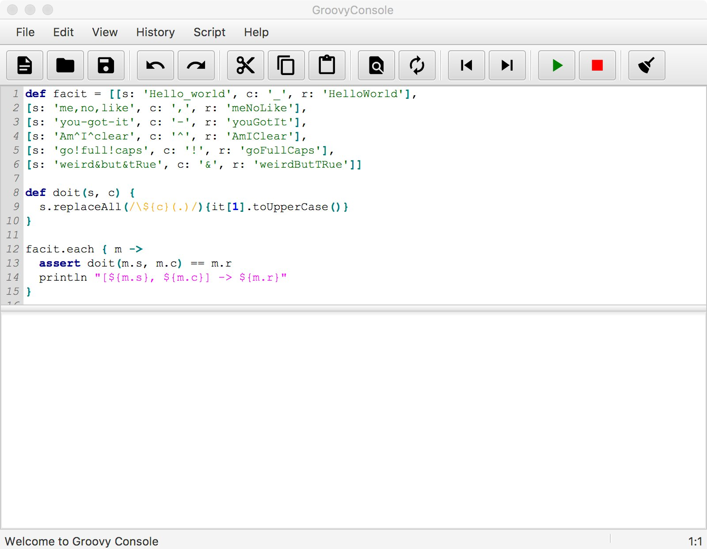

=  GroovyConsoleFX

This is an early work-in-progress. More detail will be added later.

== Building and running from source

To build from source:

    ./gradlew build

This will produce `.tar` and `.zip` distributions in `ls build/distributions/`. See "Running a distribution" for instructions on how to install and run a distribution.

To build and run in a single Gradle command:

    ./gradlew run

== Running a distribution

Currently you must build from source to get a distribution. To run a distribution, do the following.

1. Untar or unzip the distribution archive
2. Find the path to the startup script:
+
* e.g. `build/distributions/groovy-console-fx-0.1.0-SNAPSHOT/bin/groovy-console-fx` (Linux, macOS)
* e.g. `build/distributions/groovy-console-fx-0.1.0-SNAPSHOT/bin/groovy-console-fx.bat` (Windows)
3. Run the script from your command-line console
+
* Linux, macOS:
+
    $ ./build/distributions/groovy-console-fx-0.1.0-SNAPSHOT/bin/groovy-console-fx

* Windows:

    > build/distributions/groovy-console-fx-0.1.0-SNAPSHOT/bin/groovy-console-fx.bat

== Screenshot

